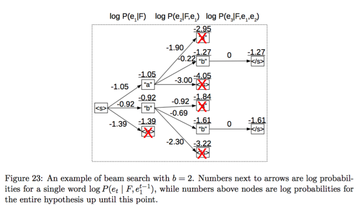
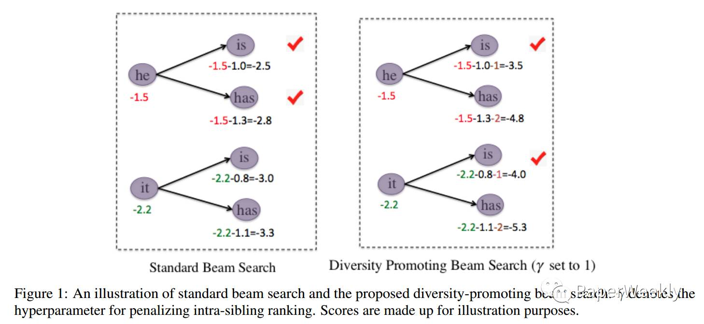
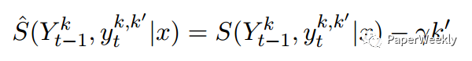

## 基于Pytorch的中文聊天机器人 集成BeamSearch算法  
    
之前一直使用tensorflow，奈何能力有限，无法驾驭tensorflow如此频繁的更新，以及2空格缩进。。。  
于是转投Pytorch， 从此打开了新世界的大门。

---
Requirements:   
[**Python3**](https://www.python.org/)  
[**Pytorch**](https://github.com/pytorch/pytorch)   
[**Jieba分词**](https://github.com/fxsjy/jieba)

---

### 关于BeamSearch算法
很经典的贪心算法，在很多领域都有应用。

在这个引用中 我们引入了惩罚因子

---

### 用法  

        # 准备数据
        python3 preprocessing.py
        # 训练
        python3 seq2seq.py train
        # 预测
        python3 seq2seq.py predict
        # 重新训练
        python3 seq2seq.py retrain

